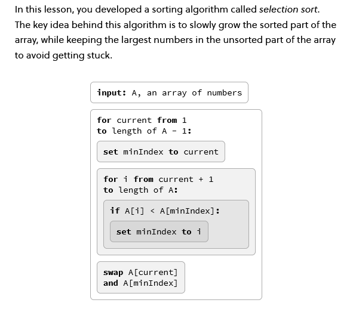
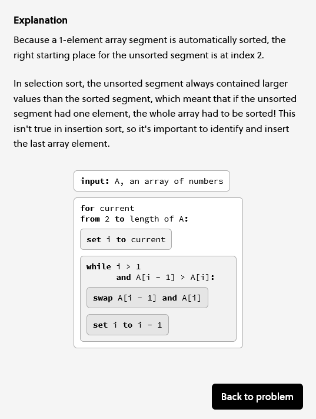

## A place to hold some code and live pages
## for sort algorithms based on Brilliant.com pseudo code


made some javascript code with p5 visualizations

of this pseudo code from Brilliant's algorithms chapter

---------
## selection sort

https://greggelong.github.io/sort/selectionSortAnimate


https://greggelong.github.io/sort/selectionSortClick


https://greggelong.github.io/sort/selectionSortFunction





----
## insertion sort


https://greggelong.github.io/sort/insertSortAnimate

https://greggelong.github.io/sort/insertSortClick

https://greggelong.github.io/sort/insertSortFunction





-----

## bubble sort

https://greggelong.github.io/sort/bubbleSortAnimate

bubble sort mystery solved.

I made a version of bubble sort in processing on my android phone while riding the subway today.

however the same conditional checking kept giving me an out of range error when checking index +1 so I subtracted -j-2 instead of -j-1 

```processing 
 if (a[i]>a[i+1]) {
    // swap
    int temp =a[i];
    a[i]=a[i+1];
    a[i+1]= temp;
    //println(i+1, j);
  }
  plota();
  // increment
  if (i < a.length-j-2) { // this really needs to be -2 as the condition above checks i+1
    i++; // increment inner loop
    println(i, a.length);
    }else {
      i=0;
      if(j < a.length){
        j++;
      }else{
    j=0;
    i=0;
    mkranda();
    plota();
      }
```

but then checked the javascript code and wondered why I was not getting an out of range error that killed the program

it really was out of range

```javascript


  if (a[i] > a[i + 1]) {  // will not give an out of range!!!!
    
    let temp = a[i];
    a[i] = a[i + 1];
    a[i + 1] = temp;
   // print(i+1);
  }

  // polot switch
  plotArr(a);

  // increment i inner 
  if (i < a.length - j - 1) {   // 
    i++;
    print(i)
  } else {
    // else increment outer and set i to zero
    i = 0;
    if (j < a.length) {
      j++;
      //print(currentIndex, a.length, a)
    } else {
      i = 0;
      j = 0;
      a = randArray(60, 1, 60);
      //print(a)
      plotArr(a);
    }
  }


```

but then I found this discussion

https://stackoverflow.com/questions/62574010/javascript-why-this-condition-si1-dont-give-an-error-out-of-range

it doesn't give out of range only undefined!!!

Using an invalid index number returns undefined.

so my logic was all wrong but I did not see it

I think javascript is helpful to the point of being dangerous

----

also a good discussion of big O of this algorithm found here

https://www.doabledanny.com/selection-sort-javascript


